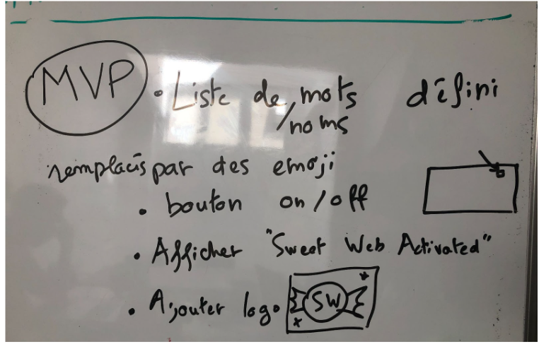
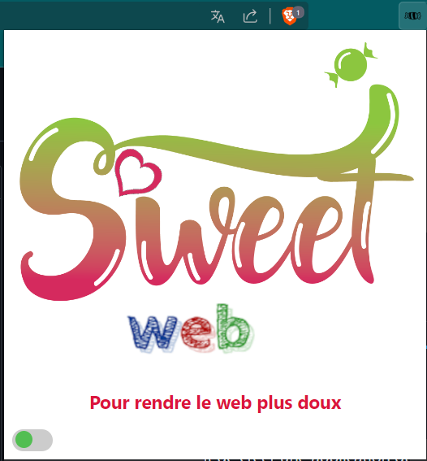
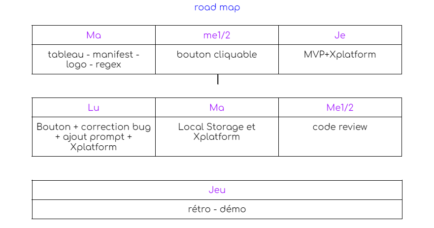
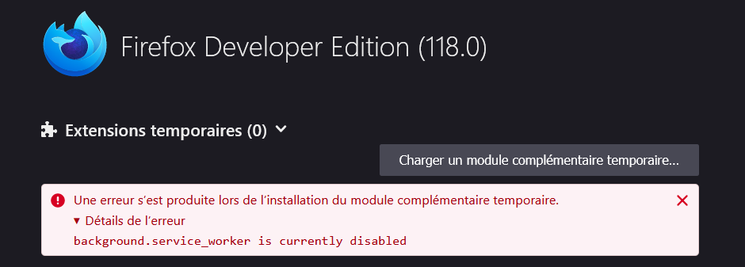

# Bonjour et bienvenue 👋

# 
SweetWeb 

  
Alexandre, Bradley Nathan et Laure vous présentent l'extension web crossplateform : 

- SweetWeb, pour rendre le web plus doux.

L'idée de départ, c'était de créer une application qui permettrait de remplacer les mots méchants par des images de bisounours. Finalement, nous avons optés pour les emojis 🦄 🐕 😻 et 💓. 

## 📅 1 Comment nous sommes nous organisés ?

Lorsque l'on commence un nouveau projet collectif, la première étape est de prendre connaissance des différentes ressources misent à notre disposition. Il est important de savoir les tenants et les aboutissants de ce qui nous ai demandé.  Cela nous a pris la première demi-journée. 

Ensuite, nous avons echangé autour des différentes idées que nous avions pour définir notre projet, des tâches que nous allions devoir accomplir et de comment nous allions nous organiser. 

- Le Daily/StandUp. Tous les matins, en arrivant, on échange pour savoir comment chacun souhaite organiser sa journée : solo, binôme, pairprogramming etc..
- La roadMap. Dès que nous sommes tombés d'accord sur le sujet et les tâches pour le réaliser, nous avons fait un MVP et une roadmap mise à jour quotidiennement. Cela nous a permis de rester dans nos délais et de ne pas trop nous éparpiller.
- La communication a été importante et toujours fluide. 
- Tous les soirs, avant d'écrire nos journaux (routine de l'Ecole), nous echangions sur nos activités de la journée : réussites, echecs, blocages, pistes de reflexion pour le lendemain. 

        
        

## 🧰 2 Nos outils principaux ?

Nous avons fait un journal de bord qui résume nos missions du jours, nous avons aussi utilisé trello pour le dispatching des tâches et l'avancement. 
Nous avons toujours communiqué et ajusté notre manière de travailler en fonction de notre avancement. 

La RoadMap nous a servi de boussole.

        

## 🤯 3 Les difficultés que nous avons rencontrés ?

Avec ce challenge, ce projet de groupe, nous avons eu surtout des défis techniques : 

- la personnalisation de la liste de banwords, 
- rendre l'application crossplateforme
- l'utilisation du local storage pour le stockage des mots rajoutés par l'utilisateur.

        

## 📣 4 La communication mise en place

La communication a toujours été bienveillante et agréable malgré les difficultés rencontrées.  Nous étions 4, nous avons alternés les binômes en fonction de notre organisation journalière, les progrès de chacun étaient communiqué tout au long de la journée. Nous avons aussi travaillés en solo ou à 4. 

On ne peut rever mieux pour travailler en équipe, car tout s'est fait en douceur. En même temps, nous sommes les portes-étendards de la douceur sur le web et de la bienveillance 💟

## 😷 5 La gestion des absents 

Nous avons du malheureusement faire face à plusieurs absents au sein de notre équipe (les virus n'ont pas décidés d'être doux avec nous) et il a fallut adapter notre manière de travailler. 
Encore une fois, cela s'est fait de manière très naturelle. Nous tenions informé la personne absente de nos avancées (ou non) via la messagerie Slack et du journal de bord.

## 💾 6 Installation 

### 🛠️ Installation    

L'installation se fait via le navigateur, il faut selectionner le mode développeur.

Ensuite, aller sur la page de gestion des extensions (ou taper about:debugging dans la barre de recherche sur Firefox).

Il faut télécharger le dossier sweetWeb via le bouton "charger extension non enpaquetée", sur les navigateurs Edge, Chrome et Brave.

Pour Firefox, une fois la page chargée, cliquer sur "Ce firefox". Là, vous allez cliquer sur le bouton "Charger un module complémentaire" et vous allez selectionner votre manifest.json dans le dossier sweetWeb-Firefox.
Et Voilà ! 
C'est fait ! Vous pouvez voir votre extension web installée. A vous de rendre votre navigation web plus douce 🥰

## 🛠️ 7 Tech Stack
- [Javascript](https://fr.wikipedia.org/wiki/JavaScript)
- [Json](https://fr.wikipedia.org/wiki/JavaScript_Object_Notation)
- [HTML](https://developer.mozilla.org/fr/docs/Web/HTML)
- [CSS](https://developer.mozilla.org/fr/docs/Web/CSS)

### 📝Le journal de bord 

[Link](https://docs.google.com/document/d/1V8AAmzXkapQc9Ds8RSSrGACGbCTynfBixwglvS2DZ8o/edit?usp=sharing)
